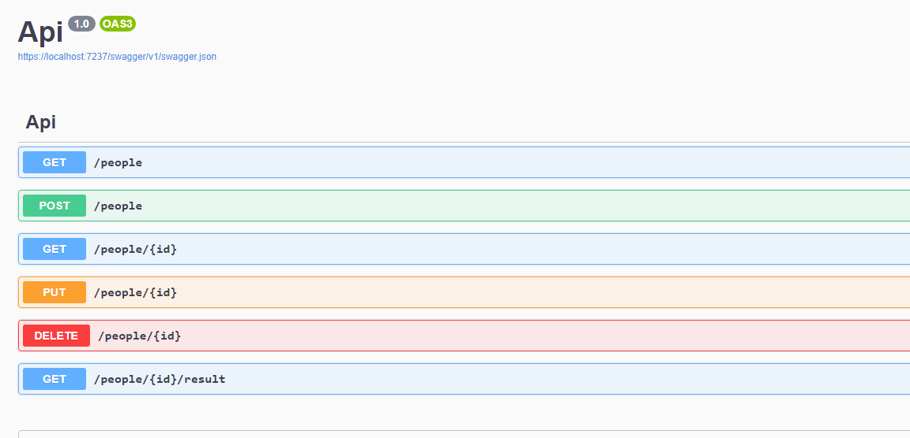
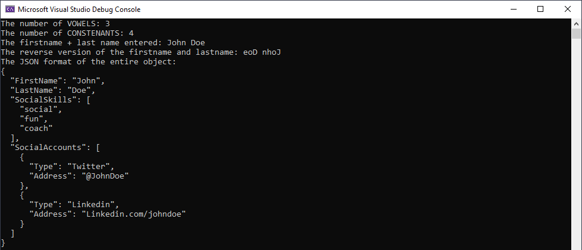

# QualificationAssignment - People Service

This is a simple demo application built to showcase the basic concepts of a layered architecture using C#, .NET Core, and JSON. 

## Getting Started

To get started, follow these instructions:

1. Clone the repository.
2. Navigate to the `PeopleService.Api` folder.
3. Run the command `dotnet run` to start the API.

## API Layer

The API layer is built using .NET Core and provides a RESTful API to access the data layer. The following endpoints are available:

* `GET /people` - returns all people.
* `GET /people/{id}` - returns the person with the specified ID.
* `GET /people/{id}/result` - returns the person with the specified ID and does some basic string manipulation and other custom output.
* `POST /people` - creates a new person.
* `PUT /people/{id}` - updates the person with the specified ID.
* `DELETE /people/{id}` - deletes the person with the specified ID.

Here is a screenshot of the API in action:

### Data Validation
This API uses the **FluentValidation** ([repo](https://github.com/FluentValidation/FluentValidation)) package to validate incoming data. FluentValidation is a popular .NET library for building strongly-typed validation rules. It allows you to define validation rules for your models in a fluent and easily-readable way, and supports complex validation scenarios such as cross-property validation and conditional validation.

In this API, each endpoint has its own validator class that inherits from the ``AbstractValidator`` class provided by FluentValidation. For example, the ``CreatePersonValidator`` class defines the validation rules for the ``POST /people`` endpoint. If the data provided by the client fails validation, the API will return a ``400 Bad Request`` response with a list of validation errors.

The use of FluentValidation in this API ensures that the incoming data is well-formed and meets the necessary requirements, improving the reliability and security of the application.

## Cui Layer

The CUI layer is built using C# and provides a command-line interface to interact with the data layer. The following methods are used:

* `Debug()` - used during development.
* `Reset()` - clears the file.
* `MyOutput()` - performs some basic string manipulation and outputs the results as part of the original requirements.

Here is a screenshot of the CUI in action:

## Conclusion

This demo application shows how to implement a basic layered architecture using C#, .NET Core, and JSON. With the API layer providing a REST API.
